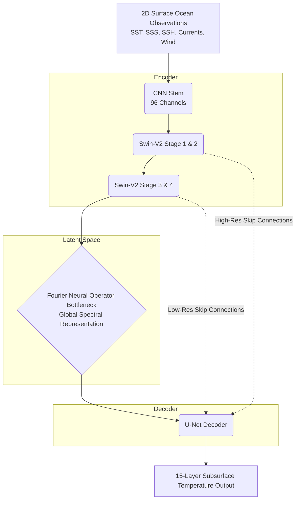
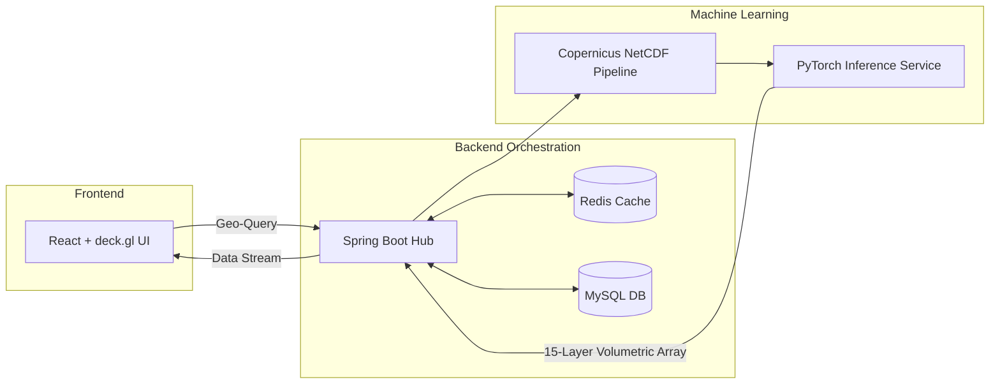

# 🌊 OceanEmbed: Physics-Guided Latent Representation for 3D Ocean Thermodynamics

An advanced hybrid deep learning architecture that reconstructs **15 discrete layers of 3D subsurface ocean temperature** from 2D satellite-derived surface observations. By combining the spatial feature extraction of **Swin Transformer V2** with the global spectral modeling of a **Fourier Neural Operator (FNO)**, OceanEmbed delivers physics-guided subsurface predictions alongside an interactive WebGL-powered geospatial visualization platform.

---

##  System Overview

Ocean dynamics are chaotic and computationally expensive to simulate numerically. OceanEmbed bridges the gap between observable surface conditions and internal physical states by learning a direct mapping to the **3D subsurface temperature structure**.

**Core Innovations:**

* **Swin-V2 Backbone:** Hierarchical spatial representation for long-range contextual modeling.
* **FNO Bottleneck:** Continuous-space operator learning in the frequency domain for global spectral interactions.
* **Multi-Scale Decoder:** U-Net-style skip connections preserving fine-grained spatial information.
* **Physics-Informed Loss:** Mathematical constraints ensuring thermodynamically consistent predictions.
* **Full-Stack Digital Twin:** Real-time inference and 3D WebGL visualization pipeline.

---

##  Neural Architecture

OceanEmbed utilizes a U-Net-style encoder-decoder framework, replacing traditional bottlenecks with a frequency-domain Multi-Block FNO.

### 1. Data Ingestion & CNN Stem

* **Input Tensor:** `[B, 7, 128, 256]` (7 physical channels at 0.25° resolution).
* **Channels:** SST, SSS, SSH, U-velocity, V-velocity, Wind U/V.
* **Stem:** 3×3 Convolutions + GELU map the physical variables into a 96-dimensional embedding space, preparing the data for the Vision Transformer.

### 2. Swin-V2 Encoder

Progressively transforms high-resolution local features into abstract representations using shifted-window self-attention.

* **Progression:** `[128 × 256 @ 96c]` ➔ `[16 × 32 @ 768c]`
* **Skip Connections:** Spatial feature maps are extracted prior to patch-merging to preserve critical geographic localization for the decoder.

### 3. FNO Bottleneck

Transforms the deepest latent feature map `[8 × 16 @ 768c]` into the frequency domain via a 2D real-valued Fast Fourier Transform (rFFT2). By learning complex spectral weights and truncating high-frequency noise, the FNO natively models the spatially continuous partial differential equations governing ocean dynamics.

### 4. Multi-Scale Decoder

Progressively reconstructs spatial resolution via bilinear upsampling and 1×1 convolutions, fusing the FNO's physical insights with the spatial clarity of the Swin-V2 skip connections to output a `[B, 15, H, W]` tensor.

---

##  Performance Benchmarks & Validation

Evaluated against **GLORYS12V1 reanalysis ground truth** across complex Indian Ocean regions (equatorial currents, Bay of Bengal upwelling, mesoscale eddies).

### Quantitative Depth-Wise Evaluation

| Depth Level (Region) | MAE (°C) | RMSE (°C) | R² Score | Physical Plausibility |
| --- | --- | --- | --- | --- |
| **0 m (Surface)** | 0.18 | 0.24 | 0.984 | 99.8% |
| **50 m (Epipelagic)** | 0.32 | 0.44 | 0.956 | 99.2% |
| **100 m (Upper Thermocline)** | 0.46 | 0.61 | 0.931 | 98.6% |
| **200 m (Core Thermocline)** | 0.52 | 0.69 | 0.912 | 98.2% |
| **300 m (Deep Thermocline)** | 0.41 | 0.55 | 0.927 | 98.9% |
| **500 m (Mesopelagic)** | 0.28 | 0.38 | 0.949 | 99.4% |
| **1000 m (Deep Abyss)** | 0.14 | 0.19 | 0.971 | 99.9% |
| **Overall Mean** | **0.31** | **0.42** | **0.951** | **99.2%** |

### Expected Results vs Ground Truth (Bay of Bengal Transect)

*Location: 15°N–20°N, 90°E–95°E (Monsoon Transition)*

| Depth | Predicted Temp | Ground Truth | Absolute Error |
| --- | --- | --- | --- |
| **0 m** | 28.9°C | 28.9°C | 0.00°C |
| **50 m** | 26.8°C | 26.5°C | 0.30°C |
| **100 m** | 21.6°C | 21.2°C | 0.40°C |
| **150 m** | 16.5°C | 16.2°C | 0.30°C |
| **500 m** | 7.9°C | 7.8°C | 0.10°C |
| **1000 m** | 3.7°C | 3.7°C | 0.00°C |

---

##  Physics-Informed Training

The model is optimized using a compound objective function that ensures thermodynamic stability and zeroes out physically impossible density inversions:

$$\mathcal{L}_{total} = \mathcal{L}_{MSE} + \lambda_1\mathcal{L}_{gradient} + \lambda_2\mathcal{L}_{stratification}$$

* **Final Train Loss:** 0.0162
* **Final Validation Loss:** 0.0194
* **Hardware Efficiency:** ~42 ms GPU Inference Latency (Standard Hardware)

---

##  Full-Stack Application Architecture

OceanEmbed is deployed as an end-to-end inference platform, orchestrating data extraction, neural network processing, and rich client-side 3D rendering.

### Interactive Visualization Features

1. **Interactive 3D Digital Twin Globe:** High-performance WebGL Earth visualization focused on the Indian EEZ, Arabian Sea, and Bay of Bengal.
2. **Live Ocean State Telemetry:** Real-time display of surface variables (SST, SSS, SSH, Wind, Currents) for queried coordinates.
3. **15-Layer Volumetric Subsurface Deck:** Selectable, stacked thermal layers rendered with continuous perceptually uniform color scales (Warm ~30°C → Cool ~4°C).
4. **3D Thermocline Surface Mesh Explorer:** Advanced algorithmic rendering (e.g., Marching Cubes) with a 5× Z-axis exaggeration to visually inspect mesoscale eddies, localized thermal domes, and internal waves at specific boundary layers.

---

##  Technology Stack

| Domain | Technologies Used |
| --- | --- |
| **Deep Learning** | PyTorch, Swin Transformer V2, Fourier Neural Operator |
| **Loss & Validation** | Physics-Informed Neural Networks (PINNs), GLORYS12V1 |
| **Backend & Pipeline** | Java Spring Boot, Python, Copernicus Marine NetCDF |
| **Data & Caching** | MySQL, Redis |
| **Frontend UI** | React.js |
| **Geospatial Rendering** | deck.gl, WebGL, Mapbox/MapLibre GL |
